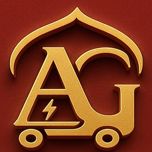

# Logo Assets

This package contains web-optimized logo files for your website.

## Files Included

### Vector Format
- **logo.svg** (2.17 KB) - Scalable vector format, perfect for responsive design

### Raster Formats (PNG)
- **logo-full.png** - Full resolution (354x441px)
- **logo-256.png** - Large icon (256x256px)
- **logo-128.png** - Medium icon (128x128px)
- **logo-64.png** - Small icon (64x64px)
- **logo-32.png** - Favicon size (32x32px)
- **logo.png** - Web-optimized standard version

## Recommendations

### For Websites
- Use **logo.svg** for main branding and headers (scales perfectly to any size)
- Use **logo-256.png** or **logo-128.png** for sidebars and cards
- Use **logo-32.png** for favicons

### For Web Implementation

```html
<!-- SVG (recommended) -->


<!-- PNG Fallback -->


<!-- Favicon -->
<link rel="icon" type="image/png" href="logo-32.png">
```

### CSS for Responsive Logo
```css
.logo {
  max-width: 100%;
  height: auto;
}
```

## Optimization Details

All files are web-optimized for:
- Fast loading times
- Minimal file sizes
- Excellent quality on all devices
- Cross-browser compatibility

## Technical Specs

- Format: PNG (32-bit with transparency) and SVG (vector)
- Color Space: RGBA (supports transparency)
- Background: Rich burgundy (8B3A3A)
- Primary Color: Golden Yellow with gradient
- Style: Modern, professional, scalable design
